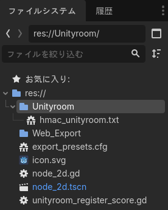
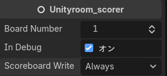
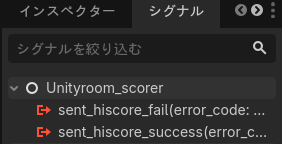
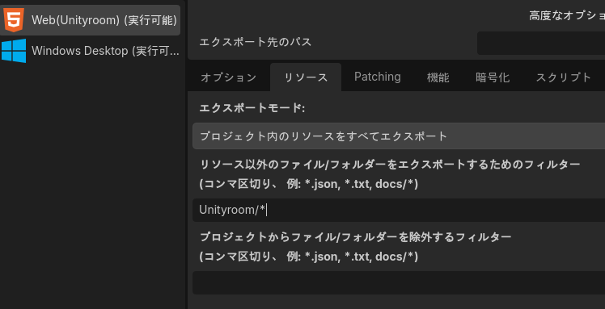
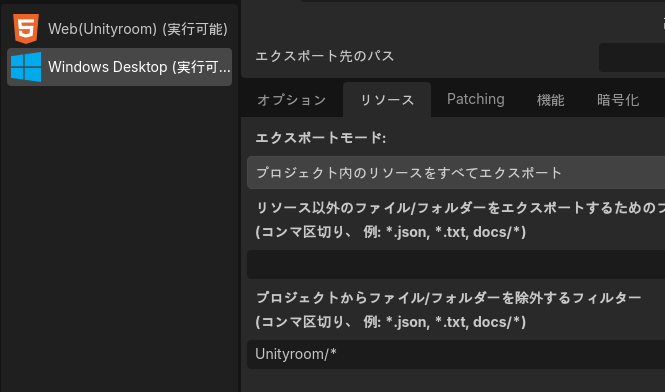

# unityroom-lib-for-godot
- GodotEngine(GDScript)用の[Unityroom](https://unityroom.com/)スコアランキングライブラリです
- ※ライブラリ公開について、[ないち様](https://github.com/naichilab)に承諾いただいていますが、非公式ライブラリです。Unityroomへの問い合わせなどは行わないでください


----

## ■概要■
- [Unityroom](https://unityroom.com/) のスコアランキング機能を、GodotEngineのWebエクスポートから手軽に扱うためのライブラリです
- Unity用のライブラリ([unityroom-client-library](https://github.com/naichilab/unityroom-client-library))を参考に作成しています
  - (※ まったく同じ動作をするわけではありません)

----

## ■対応環境■
- GodotEngine4.5以降(Unityroomの対応環境に準拠)

----

## ■インストール方法■
1. ダウンロード、もしくはクローンしたファイル「unityroom_register_score.gd」を、自身のGodotプロジェクトに取り込みます
2. 適当な場所に「Node」型のノードを作成し、上記のGDScriptをアタッチします
3. 以上でインストールは完了です

----

## ■使い方■
### [ゲーム固有のHMAC用意]
1. Unityroom公式ページの、[スコアランキング機能の実装方法](https://help.unityroom.com/2e9dc3ed5de980d5a10ce7ebb145e069)を参考に、API有効化、スコアボードの用意を行います
2. 発行された「HMAC認証用キー」を、テキストファイルとして保存します
3. 以下のスクリーンショットのように、「res://Unityroom/hmac_unityroom.txt」というパスになるように上記テキストファイルを保存します(大文字小文字などのパス間違いに注意してください)  


----

### [各ノードの設定]
1. 作成したノードには、3つのプロパティがあります。ゲームに合わせて適宜設定してください

  - [Board Number]
    - 2つあるスコアボードのどちらを使用するか。詳細は公式ドキュメントを参照してください。
  - [IN Debug]
    - オンにすると、ブラウザのDevコンソールにログが出るようになります
  - [Scoreboard Write Mode]
    - 基本的にUnityroom側の設定と合わせて設定することで、無駄なアップロードを減らします
      - Always : 常時アップロードし、ハイスコアかどうかの判断をサーバ側に任せます
      - HiScoreDesc: 降順。高いスコアほど良いとみなす
      - HiScoreAsc: 昇順。低いスコアほど良いとみなす(タイムアタックなど)
 
2. ゲーム内の適切な場所(ゲームオーバー画面など)のスクリプトで、以下のように呼び出します
----
````
## unityroomスコアアップロード
func _upload_unityroom_score():
	# スコアを登録
	$Unityroom_RegisterScore.set_hiscore_value(float(Global.score))
	# 連続投稿防止用タイマーの範疇外かをチェック
	while ! $Unityroom_RegisterScore.is_Ready_Upload():
		await get_tree().create_timer(1.0).timeout
	# スコア投稿開始
	$Unityroom_RegisterScore.set_send_hiscore()
````
----
 
3. Unityroom用ノードのシグナルを、スコアアップロードの結果を知りたいノードへ接続します



4. シグナル接続された関数に、成功時と失敗時のコードを記述します
----
````
# アップロード成功
func sent_hiscore_success(_error_code:Error):
	# エラーコードがERR_SKIPの場合、ハイスコアではなかった、とみなされアップロードされていません
	# (Scoreboard Write Modeの項を参照)
	if _error_code != Error.ERR_SKIP:
		print("ハイスコアがアップロードされました")

# アップロード失敗
func sent_hiscore_fail(_error_code:Error):
	print("スコアアップロードに失敗しました")
````
----
 
5. エクスポート設定の包含/除外
- プロジェクト->エクスポート の、「リソース」の項目で、「Unityroom/*」を含めるように設定します。  

- もしくは、他のエクスポート設定も含め、全体のリソースをエクスポート対象としている場合、Unityroom用以外の設定側で、「Unityroom/*」を**含めない**ように設定します

- 以上の方法などを用い、Unityroom以外のエクスポート先にHMACキーを含めないように注意してください
 

## ■メソッドとプロパティ、シグナル■
### [シグナル]
- sent_hiscore_success(error_code:Error)
  - アップロード成功時に発火します。ただし、エラーコードがError.ERR_SKIPの場合はハイスコア未達のため実際にはアップロードされていません

- signal sent_hiscore_fail(error_code:Error)
  - アップロード失敗時に発火します。エラーコードは[Godot公式のERROR](https://docs.godotengine.org/en/stable/classes/class_%40globalscope.html#enum-globalscope-error)を参照。

### [プロパティ]
- [board_number:int]
  - スコアアップロード先のスコアボード番号指定。通常は1か2
 
- [in_debug:bool]
  - trueのとき、ブラウザのデバッグコンソールへログを表示する
 
- [ScoreboardWriteMode:String]
  - ハイスコアか否かの判断基準
    - Always : 常時アップロードし、ハイスコアかどうかの判断をサーバ側に任せます
    - HiScoreDesc: 降順。高いスコアほど良いとみなす
    - HiScoreAsc: 昇順。低いスコアほど良いとみなす(タイムアタックなど)
 
### [メソッド]
- [set_hiscore_value(_score:float)]
  - ノードへのスコア値の登録(これだけではアップロードされない)
 
- [set_send_hiscore() -> bool]
  - 呼び出されると、set_hiscore_value()でセットされたスコアをアップロードする
 
- [is_on_unityroom() -> bool]
  - unityroom環境かどうかを判断する。実際は、Webブラウザ環境か、と、HMAC値登録のtxtが有るかを見て判断している
 
- [is_Ready_Upload() -> bool]
  - 連続アップロード防止用の閾値時間外かどうかを返す。trueなら閾値範囲外(アップロード可能)
 
## ライセンス
- MITライセンス適用 - 詳細は[LICENSE](LICENSE)を参照してください。
- This project is licensed under the MIT License - see the [LICENSE](LICENSE) file for details.